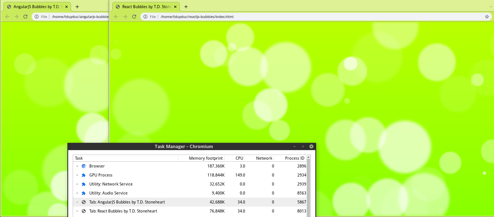

# reactjs-bubbles

Animated bubbles (or bubbly lights) in ReactJS

This app is directly ported from its [AngularJS counterpart](https://github.com/tduyduc/angularjs-bubbles). Both versions consume virtually equal CPU time; the AngularJS version tends to use less memory but the ReactJS version has cleaner code.

